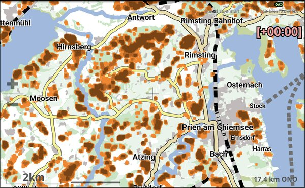
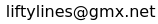

# liftyLines

Generates map layer for XCTrack to display locally exposed areas.

## Use Case
- Flatland XC pilots want a quick way to spot hills, i.e. thermal triggers.
- Contour lines in XCTrack are a pain to read at low relief.
- liftyLines generates a map layer allowing you to see locally exposed terrain at a glance. 
- It builds on the concept of Topographic Position Index (TPI), because everything sounds smarter when you acronym it. See https://landscapearchaeology.org/2019/tpi/



## Table of Contents

- [Installation](#installation)
- [Usage & Arguments](#usage)
- [Map usage in XCTrack](#map-usage-in-xctrack) 
- [Notes on liftylines_theme.xml](#notes-on-liftylines_themexml)
- [Pitfalls](#pitfalls)
- [License](#license)
- [Attribution](#attribution)

## Installation
liftyLines is a Java application (Linux/Windows/Mac), thus you must have a Java Runtime Environment version 17 or newer (Oracle jre1.8 is not enough!). In doubt, check `java -version` in cmd or install OpenJDK in newest version.
- Download the latest build from this github page
- Unzip to a folder in your user-space (e.g. `/home/you/liftyLines/` or `C:\Users\you\liftyLines\`)
- Optional: Create a shortcut to executable so you don’t have to type full paths like it’s 1998. If you don’t know how -- you guessed it -- summon Google or ChatGPT.

## Usage
This is a command-line tool. You're here, so you clearly know what that means, right?
### Simplest usage as a starting point
- Create an empty directory where you want the .map file to land.
- Navigate (cd) to that directory in command-line.
- Start liftyLines (Linux,Mac: `/path/to/liftyLines/bin/liftyLines` or Windows: `C:\path\to\liftyLines\bin\liftyLines.bat`, or use that shortcut you swore you'd make in the previous step) to generate your 
first map.
  - liftyLines will download the required raw data on-the-fly. It will be saved in subdirectory /tiles/ to avoid downloading the same tiles multiple times. Cleaning up is left to your discretion.
  - liftyLines will bake a .map (Bavaria's Chiemsee region) and a .xml theme, both should now live in your current directory and are ready for XCTrack.

Sorted that out, you wanna dig deeper by using liftyLines with arguments.

### Arguments you should use

| Argument          | Description                                                                                                                                                                                                                                                   | Valid values                                                         | Default value          |                                                                                            
|-------------------|---------------------------------------------------------------------------------------------------------------------------------------------------------------------------------------------------------------------------------------------------------------|----------------------------------------------------------------------|------------------------|
| --bbox            | Bounding box that defines the region of your map. Use a tool like http://bboxfinder.com/ to get the desired region.                                                                                                                                           | (float) minLat,minLon,maxLat,maxLon in exactly this order as degrees | 47,12,48,13            |       
| --mountain-cutoff | It makes no sense to mark mountainous regions with liftyLines -- as a pilot you hopefully see summits without consulting your phone, and the extensive triggers will definitely pollute your map. Areas with altitude higher than the cutoff will be ignored. | (integer) elevation in meters                                        | 1000                   |
| --map-name        | Name of the resulting map files.                                                                                                                                                                                                                              | (String) valid path                                                  | working directory name |                                                                                                                                                                                                                        |
| --help            | Admit defeat and get usage instructions.                                                                                                                                                                                                                      |                                                                      |                           

#### Examples:
```bash
liftyLines --bbox=47.8,12,48,12.7 --mountain-cutoff=1000 --map-name=Chiemsee
liftyLines --bbox=-5,-40,-4,-39 --mountain-cutoff=500 --map-name=Sertão
```

### Arguments you might want to use

| Argument                            | Description                                                                                                                                                                                                                                      | Valid values                       | Default value                            |
|-------------------------------------|--------------------------------------------------------------------------------------------------------------------------------------------------------------------------------------------------------------------------------------------------|------------------------------------|------------------------------------------|
| --working-dir                       | Specifies target directory for output files if you don't want to cd to your working dir.                                                                                                                                                         | (String) valid path                | Current dir in command-line              |
| --tpi-cutoffs                       | This parameter controls sensitivity of the TPI calculation. The lower the numbers, the more area is marked as lifty. This parameter also controls how many layers with different color for different TPI levels are drawn.                       | (float) array                      | 10,15,20                                 |
| --radius-small <br/> --radius-large | Those radii control TPI calculation. The larger the numbers, the wider the surrounding area considered for TPI calculation.                                                                                                                      | (float) in arcsec. lat ~ 30 meters | --radius-small=5 <br/> --radius-large=15 |
| --zoom-min                          | The lifty map becomes invisible in XCTrack when zooming out. This is intended and convenient. With this argument you can control at which zoom level the map shows up. You can also change that in the .xml theme without calculating a new map. | (integer) [0; 20]                  | 11                                       |
| --write-config   <br/> --config     | Tired of typing all those arguments and fat-fingering your way into errors? Use this to spit out a config file you can tweak like a pro and reuse later. Always resides in current directory!                                                    |
| --osmosis-mode                      | Wanna inspect those fancy maps on your PC? Osmosis mode additionally generates an .osm map that can be used in QGIS or other programs.                                                                                                           |
| --debug                             | If you are running into problems this will increase output and error information                                                                                                                                                                 |                                    |

#### Examples:
```bash
liftyLines --bbox=47,12,48,13 --mountain-cutoff=1000 --working-dir=/home/you/liftyProjects
liftyLines "--working-dir=C:\Users\Karl Klammer\lifty" # blame Windows for whitespace
liftyLines --bbox=47,12,48,13 --radius-small=10 --radius-large=20 --tpi-cutoffs=15,25 --zoom-min=9
liftyLines --bbox=47,12,48,13 --radius-small=10 --tpi-cutoffs=10,20 --write-config
liftyLines --config # requires that you created the conf file before, see previous line
liftyLines --config --bbox=47,11,48,12 # uses the conf file but overrides bounding box
liftyLines --bbox=47,12,48,13 --osmosis-mode --debug
```

### Arguments you should only use if you know what you are doing
These parameters control resolution, zoom-levels, and the existential pain of rendering errors. Only poke at them if you're customizing --zoom-min or experience rendering errors. Check out https://github.com/mapsforge/mapsforge/blob/master/docs/Getting-Started-Map-Writer.md for more information.

| Argument         | Description                                                                | Valid values         | Default value          |
|------------------|----------------------------------------------------------------------------|----------------------|------------------------|
| --zoom-string    | Control the zoom intervals and the resolution.                             | it is... complicated | 5,0,7,10,8,10,11,11,21 |
| --simplification | Controls simplification for Mapsforge map-writer. Ignored in osmosis-mode. | (int)                | 11                     |
| --simplification-max-zoom                 | The maximum base zoom level to apply simplification. Ignored in osmosis-mode.                      | (byte)               | 11                     |
                                                                                                                                                                                                

## Map usage in XCTrack
- Copy the .map and the .xml theme file to the Roadmap folder in XCTrack. As Android loves protecting its precious app directories, file transfer usually works best via USB. Plug your phone into your computer (yes, with a cable), allow file transfer (yes, that extra tap), then navigate to: `/Android/data/org.xcontest.XCTrack/files/Map/Roadmap` and paste.
- In XCTrack preferences/Maps/Road Map/Custom map style -> select the .xml theme you copied before. Confirm your choice.
- In XCTrack preferences/Maps/Road Map/Map files/Manage -> activate the .map you copied before. Note that you can activate multiple maps, thus you can use normal road maps beside several liftyLines maps.
- Zoom in for eye-candy.

If you want to try out such a map before installing liftyLines, [download the sample map.](images/Chiemsee.zip) Enjoy swiping your way to Bavaria if you live down-under.

## Notes on liftylines_theme.xml
The theme file is based on https://github.com/hyperknot/hyperpilot. It defines how your roadmap appears, and how the liftyLines layers are displayed. You can fully adjust that to your preferences or use other themes, it is only essential that the liftyLine tags are defined in your theme. You can also control the colors of liftyLines here.

The theme file is not bound to a specific map you generate. Typical use case is that you use have one theme file and several maps for different regions in XCTrack. But note that the number of layers matters here (the theme controls colors!), so you want to compute all your maps with the same number of tpi-cutoffs. 

## Pitfalls


### Memory issues
The larger the map, the more likely you will experience memory issues. However, a bounding box stretching over 5 deg latitude (~500km) and
5 deg longitude should still be fine without tweaks. Wanna go big but run into memory issues? You have a couple of options:
- Increase Java heap space. Java, in all its infinite wisdom, defaults to running your programs with the memory allowance of a 2003 flip phone. Meanwhile, your system is sitting on tons of RAM, idling like a bored gorilla in a zoo. To unchain it, do `export _JAVA_OPTIONS="-Xmx16g"` to increase heap space to 16GB or whatever you want. No worries about breaking stuff -- after reboot Java forgets that option like a goldfish with a memory leak. Google or ChatGPT to learn more.
- Use a smaller bounding box. You can activate several maps in XCTrack simultaneously to cover larger regions.
- Use mountain-cutoff. Boot those monster peaks off your map like non-welcome party guests just showing up to drink your beer and occupy the bathroom.
- Increase tpi-cutoffs to be more picky in terms of marking lifty terrain. Switching to one layer also saves memory.
- Get yourself a proper workstation.

### osmosis-mode
Great for testing/debugging as you can check out the resulting .osm map directly on your PC with various programs, even a text editor. Note that
- osmosis-mode is slower and more memory demanding than normal mode. Memory issues, especially with the mapsforge map-writer buffers, are more likely in this mode.
- .osm maps can get huge. Start with small bounding boxes.
- If you installed Osmosis with map-writer plugin on your PC before, liftyLines is likely to crash because map-writer plugin is found twice then. Simply delete mapsforge-map-writer-0.25.0.jar in your liftyLines install/lib dir to fix that.

## Contact
Bugs, questions or suggestions? Write me:\


## License
All original files (see copyright) are free software: you can redistribute and/or modify them under the 
terms of the GNU Lesser General Public License as published by the Free Software
Foundation, either version 3 of the License, or (at your option) any later version.

This program is distributed in the hope that it will be useful, but WITHOUT ANY
WARRANTY; without even the implied warranty of MERCHANTABILITY or FITNESS FOR A
PARTICULAR PURPOSE. See the GNU Lesser General Public License for more details.

You should have received a copy of the GNU Lesser General Public License along with
this program. If not, see <http://www.gnu.org/licenses/>.

## Attribution
### Raw data
This project does not redistribute raw data, it just calculates maps. Raw data is instead downloaded by users on-demand
from https://s3.amazonaws.com/elevation-tiles-prod/skadi/, which is part of the AWS Open Data Terrain Tiles program.
See https://registry.opendata.aws/terrain-tiles/ for additional information and https://github.com/tilezen/joerd/blob/master/docs/attribution.md for the license.

### Third party licenses
This project is only possible due to open-source software and third party libraries. See the `licenses/` directory for full license texts of:
- Mapsforge Core, Mapsforge Map-Writer (lgpl-3.0)
- Osmosis Core, Osmosis XML (osmosis_custom)
- Hyperpilot (MIT)
- Picocli, Google Core Libraries for Java, jspecify, j2objc, error-prone, commons-codec, commons-logging, commons-compress (apache_2.0)
- Trove4j (lgpl-2.0)
- JPF (lgpl-2.1)
- JTS Topology Suite (edl-1.0)
